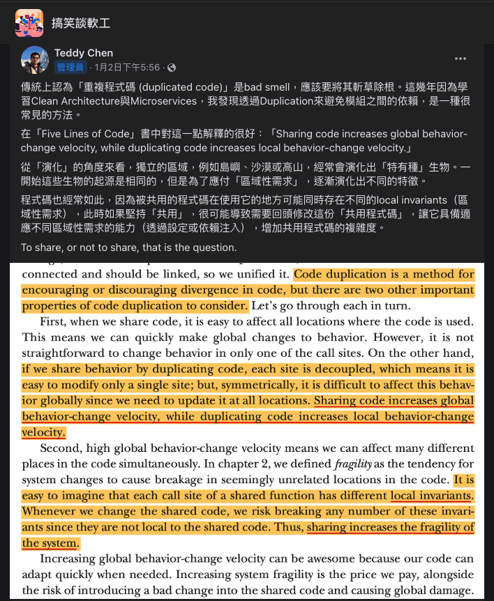

# 淺談「重覆程式碼」

---

> [!Tip]
> たじゅうかげぶんしんのじゅつ。

---

## 前言

幾天前，「Teddy」在「搞笑談軟工」發佈了一篇貼文；在貼文中，「Teddy」說，他最近讀了一本書為「[Five Lines of Code: How and when to refactor](https://www.amazon.com/Five-Lines-Code-when-refactor/dp/161729831X)」，而他認為書中對於「重覆程式碼（Duplicated Code）」的見解相當有道理，如下：

事實上，也就如貼文中所述，近年來由於「微服務架構」的盛行，透過讓相同的程式碼「重覆」存在於不同的組件中，以此來減少程式組件之間「依賴」的方式越發常見。

不過這種方式與過往的軟體開發觀念相互牴觸，在過去，「重覆程式碼」是一個相當負面的詞，其不僅會降低程式碼的「可維護性」，還可能會損害「程式架構」的穩定性；「[Clean Code: A Handbook of Agile Software Craftsmanship](https://www.amazon.com/Clean-Code-Handbook-Software-Craftsmanship/dp/0132350882)」一書的作者「Robert Martin」就曾說過，他認為，「重覆程式碼」是一種程式的「壞味道（Bad Smell）」。

但為什麼現在人們開始接受「重覆程式碼」了呢？

對於這個問題，「Teddy」認為，「Christian Clausen」在「[Five Lines of Code: How and when to refactor](https://www.amazon.com/Five-Lines-Code-when-refactor/dp/161729831X)」一書中的解釋相當獨到；「Christian Clausen」認為，使用「共用程式碼」的方式可以增加「全域」異動的速度，而使用「重覆程式碼」的方式則是可以提高「局部」異動的速度，原文如下：

> Sharing code increases global behavior-change velocity, while duplicating code increases local behavior-change velocity.

對於該描述，「Teddy」用生物學中的「特有種」來譬喻，他說，在生物學中有一個名詞叫「特有種」，其是指，同一物種，因隔離成獨立的不同族群，最後因為各自的生存環境不同進而演化出各自獨特的「性徵」的情況；「Teddy」說，程式碼也是如此，同樣一段「程式邏輯」，其可能會因為使用的地方不同，而需要一些額外且獨有的邏輯，詳見「[也許我不會刪除你：重複程式碼不等於壞味道](http://teddy-chen-tw.blogspot.com/2023/01/blog-post.html)」，原文描述如下：

對於「Teddy」的這段描述，筆者深以為然，舉例來說，在銀行的系統中，「櫃檯人員」使用的「端末系統」與一般客戶使用的「網路銀行」就明顯地「區域性差異」，譬如，「現金」相關的操作就是其中之一，因為「網路銀行」無法接受「現金」，所以它就無法操作與「現金」相關的交易，以「轉帳」來說，若使用「網路銀行」操作「轉帳」，「扣款帳號」就會是一個必要的參數，但若以「臨櫃」來說，其就會因為可以使用「現金」，而使得「扣款帳號」不再必要。

在上述的例子中，若我們要「網路銀行」與「端末系統」能使用同一個「轉帳」的程式邏輯，那麼我們就必須在該段程式碼中加入一些必要的判斷式，但如此一來，其多少都會提高該段「程式碼」的複雜度，倘若過度，甚至可能會導致該段「程式碼」的「可維護性」降低；反之，若我們將「網路銀行」的「轉帳」與「端末系統」的「轉帳」分為兩個「服務」，並讓它們擁有各自獨立的程式碼，那麼我們就可以避免這種為了因應「區域性」差異而存在的程式碼，但同樣的，同為「轉帳」功能，其必然存在需多相同的部分，而該些部分就會面臨「重覆程式碼」的議題。

所以，我們就要來談談，如何對待「重覆程式碼」。

其實筆者最近的工作項目恰巧是負責一大型「微服務專案」的「程式架構」的「規劃」與「審查」，爲此，筆者已經燒死不少腦細胞，尤其在「重覆程式碼」的議題，更是讓筆者反覆思量許久；由於「微服務架構」的關係，使得「共用程式碼」的成本變得更高，因此，在專案的領域切分，或是架構設計，都必須更為考究；所以，我們今天就來談一談重覆程式碼「抽取」的標準。

## 正文

### 「重覆」或「共用」

開門見山的說，就如同「DRY」原則的描述：

> Don’t repeat yourself.

在大原則下，筆者仍然認為：「重覆程式碼」是不應該被允許的。

在筆者過去的經驗中，「重覆程式碼」是一種在軟體開發時相當常見的情況，導致其發生的原因很多，譬如「歷史的包袱」、「多人共同開發」、「時程的過度擠壓」，甚至是「開發者的素質」都是；但不管成因為何，毫無疑問地，「重覆程式碼」顯然不是一件好事，它不僅是讓程式碼顯得「冗余」，還會導致另外一個「壞味道」：「霰彈式修改（Shotgun Surgery）」，一言以蔽之，就是「到處都是」；譬如說，我們將資料庫連線的資訊撰寫在各個有使用到的類別中，如此一來，倘若當資料庫的連線資訊改變時，其就會發生我們必須分別地將所有有存放資料庫連線資訊的類別都進行修改，先不說其費時費力，萬一修改時發生遺漏，那麼就會導致程式的錯誤；而「重複程式碼」亦是同理，當一相同的程式邏輯出現在多個不同的地方時，此時，萬一該段程式碼的邏輯需要異動，那麽，我們就同樣地會面臨到須對所有的「重複程式碼」都進行同樣的情況。

因此，筆者始終認為，「重覆程式碼」是不應該被允許的；但這並不是說，我們需要將「重複程式碼」視為萬惡淵藪、毒蛇猛獸，事實上，倘若盲目地遵守「DRY」原則，其可能就衍伸出另外一個問題，「過早的抽象（Premature Abstraction）」。

何謂「過早的抽象」？

簡單的說，就是在不夠清楚專案全貌時，就將「程式碼」給「架」進了「設計的框」；關該議題，網路上其實有著不少的相關討論，譬如「[What is "premature abstraction"?](https://softwareengineering.stackexchange.com/questions/386570/what-is-premature-abstraction)」、「[SOLID vs. Avoiding Premature Abstraction](https://softwareengineering.stackexchange.com/questions/65690/solid-vs-avoiding-premature-abstraction)」。

而這樣會有什麼的問題呢？

試想，當專案隨著時間的推移，其可能會「增加」新的功能，也可能會「修改」既有的功能，但不論何者，它們都可能會使專案的「Context」或「Boundary」產生變化；此時，原先「設計的框」就可能會出現不敷「新邏輯」使用的情況；換句話說，就是「新需求」使得「程式碼」的邏輯超出既有程式架構所預期的「框」。

這聽起來很糟，但是這種情況卻是相當的常見，因為沒有人能夠提前知道專案最終的情況，即便是相當專業的應用架構師；雖然在規劃程式架構時，其通常會盡可能地保有架構的彈性、擴展性，但這也是有限度的，不能盲目地「無限上綱」，否則就可能會落入「過度設計」的「胡同」之中，關於「過度設計」的議題可以參考「[探索真正的需要，避免過度工程化](https://www.ithome.com.tw/voice/91845)」。

然而，在大多的情況下，「新需求」都是必須執行的，即使在新的「業務邏輯」會破壞既有的框架的情況下亦然，所以，通常我們也只能被迫在「疊床架屋」或「重構」之間做選擇，前者，我們將會產生一定程度的「技術債」，或許不用在當下立刻償還，但其終究是「潛在成本」，而後者就更不用說了，「重構」就是「成本所在」。

那如何解決上述的問題呢？

### 重構的最佳時機

若我們仔細思考，其實很容易就會發現，上述的問題在於「過早（Premature）」，而非「優化」，也就是「時機點」不對；事實上，關於「過早的優化（Premature Optimization）」，知名電腦科學家「Donald Knuth」就曾說過：「過早的優化」，是萬惡的根源，更是導致「成本」大幅提高的主要兇手，其原文如下：

> The real problem is that programmers have spent far too much time worrying about efficiency in the wrong places and at the wrong times; premature optimization is the root of all evil (or at least most of it) in programming.

那哪時候是適合的「時機點」呢？

對於該問題，「Martin Fowler」所提倡的「三次重構原則（Rule of Three）」，就是相當簡單、直接，且容易使用來判斷「重覆程式碼」是否該「重構」的方法之一；「三次重構原則」的定義如下：

> Three strikes and you refactor.

其意思是說，在開發的過程中，當第三次碰到需要相同邏輯的程式碼時，我們就將之「重構」；詳見其著作：「[Refactoring: Improving the Design of Existing Code](https://www.amazon.com/Refactoring-Improving-Design-Existing-Code/dp/0201485672)」；雖然「三次重構原則」是一個相當簡單、易懂，用於判斷是否該「重構」的指標，但思考一下，僅憑「次數」的判斷方式，是否顯得有些許粗暴呢？

在回答這個問題之前，我們暫且先回歸本質來思考一下，為什麼需要將「重覆」的程式碼抽取成「共用」？

前面說過，「重覆程式碼」的問題在於，其可能會導致該專案的「可維護性」降低；那抽取成「共用程式碼」之後就不存在維護上的問題了嗎？

當然不是，很多的事情都是「一體兩面」，而「共用程式碼」亦不例外，事實上，「共用程式碼」的缺陷在「微服務架構」中尤其明顯；就如同在「[Five Lines of Code: How and when to refactor](https://www.amazon.com/Five-Lines-Code-when-refactor/dp/161729831X)」中，「Christian Clausen」的描述如下：

> Increasing global behavior-change velocity can be awesome because our code can adapt quickly when needed. Increasing system fragility is the price we pay, alongside the risk of introducing a bad change into the shared code and causing global damage.

根據「Christian Clausen」敘述，我們可以知道，雖然「共用程式碼」的優點是顯而易見的，但其代價也是不斐的，最直接的「影響」就是當其的程式碼存在問題時，其可能會導致「全域性」的破壞，因為「共用程式碼」的作用範圍是「全域性」的，所以當它存在錯誤時，其影響的範圍也將會是遍佈「全域」；此外「Christian Clausen」認為，「共用程式碼」會因為增加代碼間的「耦合度」，進而增加系統「脆弱性（Fragility）」。

由上述這段話，我們可以知道，將程式碼抽取成「共用」並不是代表其就不再需要調整，事實上，就如同，「林信良」在「[面對抽象雙面刃](https://www.ithome.com.tw/voice/106025)」中的敘述，「重構」是指「優化」程式碼的過程，但不見得都是將程式碼「抽象化」，亦可能為反向，如下：

所以，在筆者的觀念裡，「重構」應該是一個「持續」發生的過程，我們應該不斷地「重構」，在任何我們有需要時，就如同「[對於重構的兩則常見誤解](https://www.ithome.com.tw/voice/79813)」一文中所描述的：「重構的活動應該伴隨著我們一般開發過程中的主要活動來進行」，如下：

至此，我們知道，「重構」應該是一件持續的事情，無論在開發時期、維護時間、錯誤處理，只要遇到不合宜的狀況，我們就應該修正；接著，回到我們原先的問題：若依照「三次重構原則」的概念，僅憑「次數」就作為判斷是否「重構」的依據，其是否顯得有些許粗暴呢？

其實「三次重構原則」本來就是一個概念，就「重構」而言，所謂的「最佳時機」本來就無法一概而論，其會因為業務性質、專案特性、團隊習慣⋯等因素的不同而有所不同；但別忘了，「重構」本就應該是一件持續的事情，「三次重構原則」只是讓我們降低發生「過早的優化」機率，並非讓我們能夠一勞永逸地魔法。

### 區域性不變量

接著，我們來談一個名詞：「區域性不變量（Local invariants）」。

其是「Christian Clausen」在「[Five Lines of Code: How and when to refactor](https://www.amazon.com/Five-Lines-Code-when-refactor/dp/161729831X)」中，談論「共用程式碼」時所提到的「詞彙」；他說，對「共用程式碼」而言，其可能會因為呼叫它的區域不同，而有著不同的流程、邏輯，以「跨行轉帳」為例，「跨行轉帳」是「銀行」的一個服務項目，通常來說，銀行的客戶可以透過「臨櫃」，或是操作「ATM」、「網頁」與「手機應用」來完成，而上述的四種方式，雖然都是「跨行轉帳」，但其業務邏輯卻可能會因為來源途徑不同而有著不同的流程，譬如「臨櫃」可能還需要輸入「櫃檯」服務專員的員工編號，而且不同業務的執行權限也可能不同，而「ATM」則是得先從「卡號」獲得客戶資訊；「網頁」與「手機應用」則有「憑證」、「綁定硬體裝置」的限制；而我們為了使「共用程式碼」能因應各種不同的呼叫，所以我們就被迫需要在「共用程式碼」中加入一些判斷，或修改流程，而如此行爲的代價都就是會提高「共用程式碼」的「複雜度」與「耦合度」，最後反而導致程式碼的「可維護性」降低。

所以，我們就不應該抽取「共用程式碼」嗎？

在「[When You SHOULD Duplicate Code](https://medium.com/@mariusbongarts/when-you-should-duplicate-code-b0d747bc1c67)」一文中，其作者「Marius Bongarts」引用了「Andy Hunt」和「Dave Thomas」在「[The Pragmatic Programmer: Your Journey To Mastery](https://www.amazon.com/gp/product/0135957052)」一書中，他們對「DRY」原則的描述：

> Every piece of knowledge must have a single, unambiguous, authoritative representation within a system.

在描述中，「Marius Bongarts」特別點出「Andy Hunt」和「Dave Thomas」的用詞是「`Every piece of knowledge`」，而非「`Every piece of code`」，原文如下：

事實上，「Robert Martin」在「[Clean Architecture: A Craftsman's Guide to Software Structure and Design](https://www.amazon.com/Clean-Architecture-Craftsmans-Software-Structure/dp/0134494164)」一書中也有類似的描述，在談論「重覆程式碼」的議題時，「Robert Martin」寫道，即使是兩段完全相同的程式碼，若其有著各自不同的「演化」軌跡，那麼，它就不能算是真正的「重覆程式碼」，原文如下：

> If two apparently duplicated sections of code evolve along different paths—if they change at different rates, and for different reasons—then they are not true duplicates.

對於這類的「重覆」，「Robert Martin」稱它們為「意外的重覆（Accidental Duplication）」；他進一步解釋道，即便是兩段完全相同的程式碼，它們也只是當下「情況」是「相同」的，但最後它們終究會因為「業務性質」的差異而發展成不同的樣子，所以我們應避免將它們「統一」，否則，我們之後就必須面臨到將它們分開的挑戰。

至此，我們已經清楚地知道要判斷是否為「意外的重覆」的關鍵是：「業務特性」；也就是「Andy Hunt」和「Dave Thomas」所說的「Every piece of knowledge」；倘若以這個角度來看的話，「三次重構原則」的僅憑「重覆次數」就判斷的方式，稱其為「粗暴」似乎也不爲過；但令人尷尬的是，就如同「Marius Bongarts」在「[Rule of Three — Three Strikes And You Refactor](https://javascript.plainenglish.io/rule-of-three-three-strikes-and-you-refactor-942d13e7d5cd)」所說的，對多數的開發者而言，尤其是在缺乏產業知識的情況下，其想要區別「真正的重覆」與「意外的重覆」是困難的，但判斷是否為「第三次」碰到的「重覆程式碼」卻是輕而易舉。

## 參考資料

- [SOLID vs. Avoiding Premature Abstraction](https://softwareengineering.stackexchange.com/questions/65690/solid-vs-avoiding-premature-abstraction)
- [What is "premature abstraction"?](https://softwareengineering.stackexchange.com/questions/386570/what-is-premature-abstraction)
- [Marius Bongarts, When You SHOULD Duplicate Code](https://medium.com/@mariusbongarts/when-you-should-duplicate-code-b0d747bc1c67)
- [Marius Bongarts, Rule of Three — Three Strikes And You Refactor](https://javascript.plainenglish.io/rule-of-three-three-strikes-and-you-refactor-942d13e7d5cd)
- [Christian Clausen, Five Lines of Code: How and when to refactor](https://www.amazon.com/Five-Lines-Code-when-refactor/dp/161729831X)
- [David Thomas, Andrew Hunt, The Pragmatic Programmer: Your Journey To Mastery](https://www.amazon.com/gp/product/0135957052)
- [Robert Martin, Clean Code: A Handbook of Agile Software Craftsmanship](https://www.amazon.com/Clean-Code-Handbook-Software-Craftsmanship/dp/0132350882)
- [Robert Martin, Clean Architecture: A Craftsman's Guide to Software Structure and Design](https://www.amazon.com/Clean-Architecture-Craftsmans-Software-Structure/dp/0134494164)
- [Martin Fowler, Refactoring: Improving the Design of Existing Code](https://www.amazon.com/Refactoring-Improving-Design-Existing-Code/dp/0201485672)
- [林信良, 面對抽象雙面刃](https://www.ithome.com.tw/voice/106025)
- [王建興, 探索真正的需要，避免過度工程化](https://www.ithome.com.tw/voice/91845)
- [王建興, 對於重構的兩則常見誤解](https://www.ithome.com.tw/voice/79813)
- [陳建村, 也許我不會刪除你：重複程式碼不等於壞味道](http://teddy-chen-tw.blogspot.com/2023/01/blog-post.html)