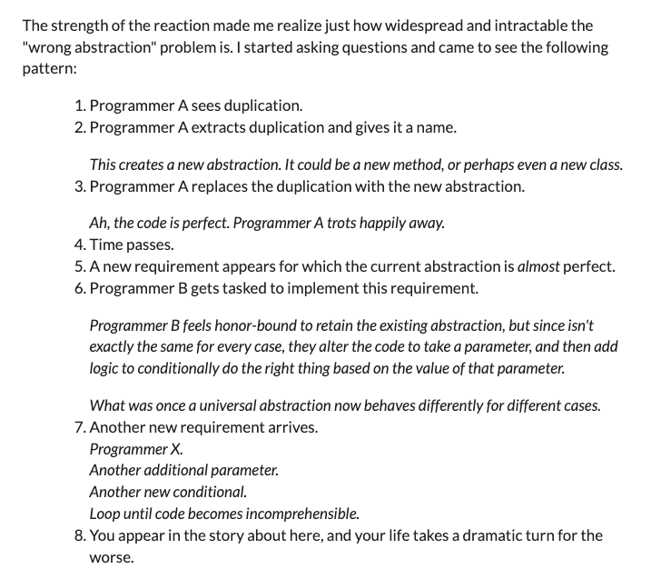
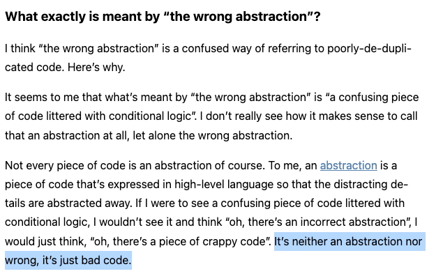
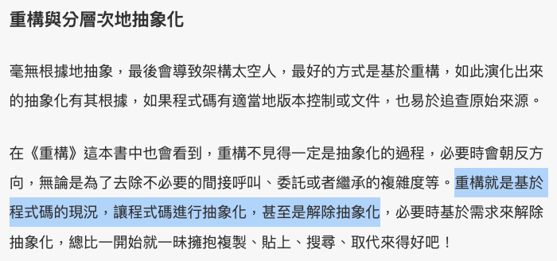

# [2023-02-13] 淺談「錯誤的抽象」

---

> [!Tip]
> 我達達的馬蹄是美麗的錯誤
> 我不是歸人，是那匹馬

---

## 前言

在「2014」年的「RailsConf」中，一位美國工程師「Sandi Metz」提出了「錯誤的抽象」的這個概念；「錯誤的抽象」，其原文為「The Wrong Abstraction」，「Sandi Metz」說，她認為「重覆程式碼（Duplicated Code）」所造成的「技術債」比起「錯誤的抽象」所造成的「技術債」還要「低廉」，因此，她寧願接受「重覆程式碼」的存在，也不要冒著可能導致「錯誤的抽象」的風險，完整內容請參考「[RailsConf 2014 - All the Little Things by Sandi Metz](https://www.youtube.com/watch?v=8bZh5LMaSmE)」。

在「Sandi Metz」的敘述中，我們可以得知，「Sandi Metz」認為，「錯誤的抽象」會造成相對昂貴的「技術債」，並且該「債」的「程度」甚至要高於保留「重覆程式碼」所產生的量。

在筆者以往的經驗中，「重覆程式碼」是相當糟糕的一件事，將一段代碼「複製」後，並粗暴地「黏貼」在其它地方，使同樣的程式碼出現同一個專案中的兩處，甚至是多處，這行為無疑是撰寫程式碼時的「禁忌」，不少的前輩都告誡我們應該要盡量的避免此種行為；譬如耳熟能詳的「DRY」原則就是其中之一，其全文為「Don't repeat yourself.」，也就是在告訴我們，「不要」重覆程式碼，這是因爲「重覆程式碼」不僅會讓程式碼變得冗長，又由於相同的程式邏輯散佈在專案的四處，所以還可能會導致「霰彈式修改（Shotgun Surgery）」情況的發生；也因此，在筆者的認知中，「重覆程式碼」一直都是不應該被容許的。

但如今，忽然有人告訴我說：寧願接受「重覆程式碼」的存在，也不要冒著可能導致「錯誤的抽象」的風險；因此，這就不禁讓筆者好奇：什麼是「錯誤的抽象」，它又到底有多糟糕？

所以，今天我們就來談談，「Sandi Metz」口中的，「錯誤的抽象」。

## 正文

### 錯誤的抽象

什麼是「錯誤的抽象」？

在「[The Wrong Abstraction](https://sandimetz.com/blog/2016/1/20/the-wrong-abstraction)」一文中，「Sandi Metz」舉了一個例子來解釋她所稱的「錯誤的抽象」，如下：

根據其內容的敘述，筆者認為，「Sandi Metz」所謂的「錯誤的抽象」，大概就是指一段「亂七八糟」且「邏輯不清」的「抽象」；而導致這現象的原因不外乎是「不同人共同開發」以及「過早的抽象」。

事實上，「Sandi Metz」所描述的現象，在軟體開發領域中，是一個相當常見的情況；尤其是「不同人共同開發」這件事，其幾乎無可避免；以軟體開發來說，多數的大型專案進行都是以「多人合作開發」的方式，即便是「獨立開發」，其也可能會因為不可抗拒的因素而會面臨到換人開發的情況，譬如人員流動，像是人力調度、離職⋯等；而「不同」的「開發者」自然存在一些差異，譬如「程度的落差」、「習慣的不同」，以及「思維的歧異」⋯等。

但是「不同人共同開發」並非無法解決，最常見的解決方式不外乎就是透過員工的「教育訓練」，以及制定完整地「開發規範」；此外，使用比較容易上手的技術框架，與建立完善的程式架構，也都能一定程度減少因為「多人合作開發」所造成的程式碼紊亂的問題。

除了「不同人共同開發」之外，「Sandi Metz」還有提到「過早的抽象」也是「錯誤的抽象」的成因之一；事實上，「過早的抽象」也的確是個惱人的議題，尤其是在專案開發時，開發人員通常是不會知曉專案的全貌，在如此情況下，若其冒然地進行架構設計，那麼就可能因為其對專案的不了解，而使得當下設計的程式架構無法滿足未來的使用，最後迫使我們必須為了因應未來的專案需求而對當前的程式架構進行「重構」，甚至是「疊床架屋」。

知名電腦科學家，「Donald Knuth」就曾說過：「過早的優化（Premature Optimization）」是萬惡的根源，更是導致專案「成本」大幅提高的主要兇手，其原文如下：

> The real problem is that programmers have spent far too much time worrying about efficiency in the wrong places and at the wrong times; premature optimization is the root of all evil (or at least most of it) in programming.

因此，就有些人開始提倡應避免「過早的優化」的行為，譬如「過早的抽象」，其論點是：在某些情況下，我們應允許一定程度的「重覆程式碼」，即使這樣的方式可能會使得程式碼稍嫌「冗余」，但是它至少保持了程式碼碼的「簡單」、「直覺」；而該概念也正好符合「KISS」原則的概念，「KISS」是「Keep it simple, stupid.」的縮寫。

題外話，雖然「過早的優化」聽起來似乎有其有道理，但何謂「過早」，或著反過來問，到底什麼時候才是適合優化的時機呢？

對於這個問題，筆者認為「Martin Fowler」提倡的「三次重構原則（Rule of Three）」或許就是個相當不錯的選擇，它毫無疑問地是個相當簡單、直接，且容易用於判斷「重覆程式碼」是否該「重構」的標準，詳見其著作：「[Refactoring: Improving the Design of Existing Code](https://www.amazon.com/Refactoring-Improving-Design-Existing-Code/dp/0201485672)」；「三次重構原則」的全文為：「Three strikes and you refactor.」；簡單的說，就是「重覆三次」，就重構。

但「三次重構原則」並不是絕對的，事實上，筆者覺得所謂「重構」的「最佳時機」，是會因為其專案特性、團隊習慣⋯等因素的差異而有不同的；但在毫無頭緒時，「三次重構原則」就是一個很不錯的選項。

關於「過早的優化」的議題，未來倘若有機會，筆者會再另闢篇幅，現在，我們先焦點放回「錯誤的抽象」上；從「Sandi Metz」的描述中，我們可以得知，她認為「過早的抽象」是「錯誤的抽象」的成因之一，而「錯誤的抽象」會造成比「重覆程式碼」更多的「技術債」，所以「Sandi Metz」認為與其承擔因為「錯誤的抽象」而可能會產生的代價，不如直接接受「重覆程式碼」。

上述這段話乍聽之下很合理，但不知道大家有沒有察覺出一個問題？

到底是「過早的抽象」導致了「錯誤的抽象」的產生，還是「過早的抽象」經過多次「疊床架屋」的改動後，才造成「錯誤的抽象」？

其兩者並不應該混為一談，就如同「Jason Swett」在「[Why I don't buy "duplication is cheaper than the wrong abstraction"](https://www.codewithjason.com/duplication-cheaper-wrong-abstraction/)」一文中的描述，「Jason Swett」認為，「Sandi Metz」所稱的「錯誤的抽象」就只是「壞程式碼（Bad Code）」的「代名詞」而已，他說道，如果「錯誤的抽象」是一段本來就「亂七八糟、邏輯不清」的「壞程式碼」，那麽，無關它「抽象化」與否，它都只是「壞程式碼」，其，原文如下：

對於這個觀點，筆者其實是比較認同的。

就筆者的角度而言，我並不認為「錯誤的抽象」是「過早的抽象」的「果」；「錯誤的抽象」應該是「疊床架屋」的「果」，是「開發人員」沒有「不斷迭代」的「果」。

事實上，「優化」這件事在「軟體開發」的整個過程中，其應該都是一項持續進行的事情；我們應該在其尚未「亂七八糟、邏輯不清」前，就去「重構」；而不是等到其變成一團「混亂」時，再稱呼它為「錯誤的抽象」。

或許有人會說，持續地重構會造成相當的「技術債」，尤其在某些情況下，譬如缺乏完整的自動化測試，又或是既有的架構不夠彈性、既有代碼的耦合度過高；當然，也可能是「程式碼不熟悉」，譬如在多人開發的情況下，沒有了解合作夥伴們所撰寫的內容。

但就如同「Jason Swett」所說，不論程式人員不願「重構」的理由是什麼；但當該情況發生時，我們的處理方式應該是解決問題的根源，譬如，補上測試代碼，或是基於合理條件下改動原有架構、建立程式碼審查的制度；但絕對不是允許「重覆的程式碼」。

接著，我們簡單的討論一下，應該如何看待「重覆的程式碼」。

若以筆者的觀點來看，筆者不認為「重覆的程式碼」是完全不能允許存在的；事實上，筆者的觀念都是：基於某些前提下，「重覆程式碼」並不一定都是糟糕的，是可被接受的。

但這與「Sandi Metz」的「錯誤的抽象」的出發點是不同的；在筆者的認知裡，「優化」是一件持續發生的過程，我們應該不斷地「重構」，不論是在「開發時期」，亦或是「維護時期」，在專案中，只要需要，我們就應該將之「迭代」；而不是放任其發展到「亂七八糟、邏輯不清」時，再將責任推到「過早的抽象」。

筆者曾經聽過一句話，相當的認同，他說，「程式的設計是必然的，但是不能因為擔心專案需求會改動，就乾脆不做程式設計，事實上，沒有設計本身就是最糟糕的設計。」；事實上，我們要做的是，當我們發現目前的程式架構不敷當前需求使用時，我們就應該將之重構，而不是為貪圖方便而疊床架屋之。

而這句話若放在「抽象化」也是適用的，即「抽象化是必然的，但是不能因為擔心專案需求會改動，就乾脆不要抽象化。」；事實上，抽象化就是程式設計一種的樣態。

### 抽象化

最後，筆者補充一些關於「抽象化」的議題，「抽象化」是「程式設計」中常見的一種手段，也是我們常用於「優化」程式碼的方式；此外，通常而言，「重構」是指「優化」程式碼的過程，但不見得都是將程式碼「抽象化」，亦可能為反向，如同「林信良」在「面對抽象雙面刃」中的敘述，如下：

其實「抽象化」一直都存在一些爭論，著名的「抽象滲漏原則（The Law of Leaky Abstractions）」就是其中之一，該原則是由「Joel Spolsky」所提出，詳見「[The Law of Leaky Abstractions](https://www.joelonsoftware.com/2002/11/11/the-law-of-leaky-abstractions/)」或是「[Joel on Software: And on Diverse and Occasionally Related Matters That Will Prove of Interest to Software Developers, Designers, and Managers, and to Those Who, Whether by Good Fortune or Ill Luck, Work with Them in Some Capacity](https://www.amazon.com/-/zh_TW/Joel-Spolsky/dp/1590593898)」。

此外，也可以參考「林信良」的「[另眼看抽象滲漏](https://www.ithome.com.tw/voice/139011)」。

## 參考資料

- [RailsConf 2014 - All the Little Things by Sandi Metz](https://www.youtube.com/watch?v=8bZh5LMaSmE)
- [Sandi Metz, The Wrong Abstraction](https://sandimetz.com/blog/2016/1/20/the-wrong-abstraction)
- [Jason Swett, Why I don't buy "duplication is cheaper than the wrong abstraction"](https://www.codewithjason.com/duplication-cheaper-wrong-abstraction/)
- [Joel Spolsky, The Law of Leaky Abstractions](https://www.joelonsoftware.com/2002/11/11/the-law-of-leaky-abstractions/)
- [Joel on Software: And on Diverse and Occasionally Related Matters That Will Prove of Interest to Software Developers, Designers, and Managers, and to Those Who, Whether by Good Fortune or Ill Luck, Work with Them in Some Capacity](https://www.amazon.com/-/zh_TW/Joel-Spolsky/dp/1590593898)
- [Martin Fowler, Refactoring: Improving the Design of Existing Code](https://www.amazon.com/Refactoring-Improving-Design-Existing-Code/dp/0201485672)
- [林信良, 面對抽象雙面刃](https://www.ithome.com.tw/voice/106025)
- [林信良, 另眼看抽象滲漏](https://www.ithome.com.tw/voice/139011)
