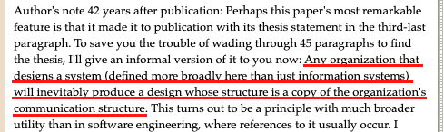
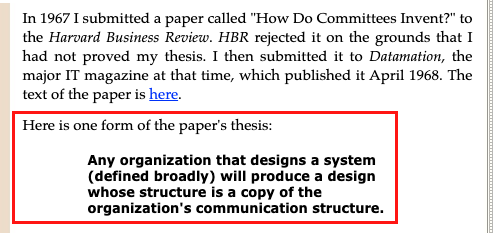
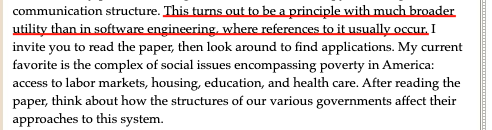

# 從「維護者」的思維看待「開發」

---

> [!Tip]
> 每一次的擴充，都不應該是疊床架屋的開始，而是以維運為本的藝術。

---

## 前言

前些日子因公參加了一場由「VMware」所舉辦的研討會，議題涵蓋「金融數位轉型」、「雲原生應用」、「DevSecOps」⋯等；其中的一場演講，內容是在分享台灣某一金融相關企業現代化轉型的過程與經驗。

該場的分享者是該企業的一位科長，同時也是該組織中，「DevOps」團隊的領導者。

在那場演講中，講者敘述了他們團隊在轉型過程中曾遭遇過的問題、阻礙，與如何因應、處理，譬如在「團隊建立」時，人員的該如何組成與配置；在「環境建置」時，產品、廠商該如何挑選，包含挑選時應該注意的重點⋯等。

另外，由於金融行業的特殊性，其資安的要求相對嚴格，所以在轉型過程中，與資安相關議題的決策就必須要更謹慎，也更需要經驗了，更別說金融單位還有法規與稽核的議題需要考慮。

在該場分享的內容中，講者的一些論述，筆者覺得相當有意思，譬如在「團隊建立」的議題上，講者他引用了「康威定律」來作為其建立團隊的基礎準則；在「系統架構」的設計上，講者則是採用他自創的「魚缸式架構」的設計方式，而最令筆者印象深刻的還是他說的一句話，他說，「每一次的擴充，不是疊床架屋的開始，而是以維運為本的藝術」；這部分我們晚點再介紹。

除了上述的議題外，筆者還有提到另外一個重點，也讓筆者不可置否；講者說，在整個轉型的過程中，他認為最為棘手、最難以處理的問題仍是在「人」，包含「人」的「溝通」與「協調」，尤其是在「跨部門合作」、「向上溝通」時，更別說其中還可能涉及「組織文化」的革新；對於「人」的議題，他們至今都仍持續地在奮戰。

前言結束了，接著，我們就來介紹上述中，那些有趣的理論吧！

## 正文

### 康威定律

首先是「康威定律」，在該場演講中，那位科長說，他在「構建團隊」時，以「康威定律」作為其執行的基礎準則；不過，什麼是「康威定律」呢？

為什麼它能作為「構建團隊」的基礎準則？

其實，「康威定律」之所以能夠作為「構建團隊」的準則是因為它本來就是一個與「組織架構」相關的準則；「康威定律」原文為「Conway's Law」，其中的「Conway」，是一個人的名字，其全名為「Melvin Conway」，是一美國的科學家；而「康威定律」就是出自於他在「1968」年刊登在「Datamation]」上的一篇文章，題目為「[How Do Committees Invent?](http://www.melconway.com/Home/pdf/committees.pdf)」；這是一篇探討「系統設計」與「組織架構」兩者間關係的論文。

備註：「Datamation」是著名的「IT」雜誌。

說個題外話，根據「Melvin Conway」的描述，「康威定律」一詞並非由他自己提出的，雖然其概念是源自於他所發表的「[How Do Committees Invent?](http://www.melconway.com/Home/pdf/committees.pdf)」一文；「康威定律」一詞的誕生是在「1975」年，當年，「Frederick Phillips Brooks」的經典名著，「[The Mythical Man-Month: Essays on Software Engineering](https://www.amazon.com/Frederick-Phillips-Brooks/dp/0201006502)」問世，在該書中，「Frederick Phillips Brooks」引用了「Melvin Conway」在「[How Do Committees Invent?](http://www.melconway.com/Home/pdf/committees.pdf)」一文中的觀點，並以「康威定律」一詞稱之。

說個題外話，根據「Melvin Conway」的描述，「康威定律」一詞並非由他自己提出的，雖然其概念是源自於他所發表的「[How Do Committees Invent?](http://www.melconway.com/Home/pdf/committees.pdf)」一文；「康威定律」一詞的誕生是在「1975」年，當年，「Frederick Phillips Brooks」的經典名著，「[The Mythical Man-Month: Essays on Software Engineering](https://www.amazon.com/Frederick-Phillips-Brooks/dp/0201006502)」問世，在該書中，「Frederick Phillips Brooks」引用了「Melvin Conway」在「[How Do Committees Invent?](http://www.melconway.com/Home/pdf/committees.pdf)」一文中的觀點，並以「康威定律」一詞稱之。

那「Melvin Conway」在「[How Do Committees Invent?](http://www.melconway.com/Home/pdf/committees.pdf)」中的闡述是什麼？

關於這個問題的答案，在「[Mel Conway - How Do Committees Invent?](http://www.melconway.com/Home/Committees_Paper.html)」中，「Melvin Conway」是如此描述的，如下：

其意思是說，任何系統的「架構設計」都會受到其「設計者」的「組織架構」的影響；而這句話，也就是「康威定律」的定義之一，如下：

或許有讀者在此產生一個疑問：為什麼是「之一」？

就如上圖中紅色底線的部分，「Melvin Conway」在描述「康威定律」時，其用詞是「`one form of the paper's thesis.`」，也就是說，「Melvin Conway」認為，關於「康威定律」的那段敘述，其只是「[How Do Committees Invent?](http://www.melconway.com/Home/pdf/committees.pdf)」一文的一種表述形式，什麼意思呢？

筆者猜測，「Melvin Conway」以為的「康威定律」應具有更高維度的視野，以及更廣泛的適用性，而不應僅侷限於「軟體工程」領域，就像其在「[Mel Conway - How Do Committees Invent?](http://www.melconway.com/Home/Committees_Paper.html)」中，「Melvin Conway」中的描述下：

不過實際情況也就如同「Melvin Conway」 所述，「康威定律」在「軟體工程」上的引用確實相對的多，譬如知名的軟體大師，「SOLID」的提出者：「Robert Martin」；其就曾在「[Clean Architecture: A Craftsman's Guide to Software Structure and Design](https://www.amazon.com/Clean-Architecture-Craftsmans-Software-Structure/dp/0134494164)」一書中引述「康威定律」來解釋「SRP(Single Responsibility Principle)」；「Robert Martin」認為「SRP」可以視為「康威定律」的積極推論，其原文描述如下：

> An active corollary to Conway’s law: The best structure for a software system is heavily influenced by the social structure of the organization that uses it so that each software module has one, and only one, reason to change.

此外，「康威定律」還存在的許多「變體」，譬如：

> The organization of the software and the organization of the software team will be congruent.

而這段描述是「Eric S. Raymond」在「[The New Hacker's Dictionary](https://www.amazon.com/New-Hackers-Dictionary-3rd/dp/0262680920)」一書中對於「康威定律」的「重新定義」；若將之與「Melvin Conway」所描述的「康威定律」相比，其實不難發現，「Eric S. Raymond」所描述的「變體」，其指向更明確，針對性更高，其中一個明顯的關鍵就是，在「變體」的敘述中，它明確地使用了「`software`」一詞，「Eric S. Raymond」明確地將範圍侷限在了「軟體架構」上，雖然「Eric S. Raymond」對「康威定律」的描述會讓之與原版相比更為侷限，但比起維度較高、概念抽象的原始版本，「變體」的版本更常被引用，也更容易被引用，因為它直覺，不須過多的解釋。

除了「Eric S. Raymond」之外，「康威定律」還有諸多知名的「變體」，譬如：

> The structure of any system designed by an organization is isomorphic to the structure of the organization.

其意思是，任何系統的結構都會與其設計組織的結構同構；這個說法是源自於「[Structured Design: Fundamentals of a Discipline of Computer Program and Systems Design](https://www.amazon.com/-/zh_TW/Edward-Yourdon/dp/0917072111)」一書，而該書的作者是「Edward Yourdon」和「Larry L. Constantine」。

再舉一個，如下：

> If the parts of an organization—such as teams, departments, or subdivisions—do not closely reflect the essential parts of the product, or if the relationships between organizations do not reflect the relationships between product parts, then the project will be in trouble.

其意思是，倘若某一「組織結構」與其「產品結構」脫鉤，那麼該「產品」就可能會面臨到一些困境；而這個說法是「James O. Coplien」和「Neil B. Harrison」在「[Organizational Patterns of Agile Software Development](https://www.amazon.com/Organizational-Patterns-Agile-Software-Development/dp/0131467409)」一書中的描述。

至此，關於「康威定律」在本文中的介紹就暫時到此，至於其具體細節，倘若未來有機會的話，筆者會在另闢篇幅。

### 魚缸式架構

接著，我們來介紹講者在談論「系統架構設計」時所提到的一個論述：「魚缸式架構」；與「康威定律」不同，「魚缸式架構」的這套設計理論是作者自創的設計理論；其概念是說，「系統」的「架構」應該就像「魚缸」一樣，一個「大魚缸」可以由多個「小魚缸」組成，且每個「魚缸」都應該是具有「獨立性」的「個體」，其可以輕易的「被擴充」以及「被移除」。

也就是說，在「魚缸式」系統架構的概念中，每個「系統」中的每個「子系統」，其彼此都應該是要能獨立存在，且能獨立運行的；簡單說，就是「子系統」本身為「高內聚」，「子系統」間為「鬆耦合」。

咦，這概念聽起來是不是與「微服務架構」非常相似？

所以，筆者認為，「魚缸式架構」的設計概念一定程度的重疊於「微服務架構」，其兩者都是在傳遞系統的架構設計應具有「高內聚」與「鬆耦合」的特性。

### 維運為本

最後，讓我們來談談在這場演講中，最令筆者印象深刻的一個概念：「維運為本」。

在這場分享中，筆者有提到一個觀念，他說：「每一次的擴充，都不應該是疊床架屋的開始，而是以維運為本的藝術。」。

我們來咀嚼一下這句話的意思，其中，「擴充」，顧名思義，其可能是新功能的「增加」，當然也可能是既有功能的「修改」，但不論是何者，其都涉及「程式碼」的「異動」，而有經驗的開發者都知道，「異動」通常就是讓「程式架構」走向「疊床架屋」起點。

事實上，程式碼「異動」這件事本身是正常的，也沒有什麼問題，而會導致「疊床架屋」的發生，其十之八九都是源自「不符合當前架構設計」的「異動」；這段描述適用於「系統架構」層級，也適用於「程式架構」層級。

就「系統架構」層面而言，想必有過經驗的人員都知道，只要涉及「系統架構」的「異動」，不論規模是大或小，其所需代價往往不斐，舉例來說，像是容器平台的「抽換」，假設原本使用的容器平台是「K8S」，而今需求是要將容器平台從原本的「K8S」更換成「OCP」，又或是更改「資料庫」的架構、種類，像是因應標準「微服務」概念將「單資料庫」的架構改成「多資料庫」的架構，又或是將「Ms SQL Server」換成「Oracle Database」⋯等。

上述的行為雖然都不是不行，但各個都是傷筋動骨，在執行之前，我們應經過審慎的規劃，並確認異動內容與現行架構的相容及相關風險因應、備援⋯等，在執行時，其更是需要謹慎處理，因為其往往會因為一個粗心或思慮不周，就釀成難以挽回的災難。

而「程式架構」的層面亦然，當在每次程式碼「異動」之後，除了基本「程式碼風格」之外，我們更必須確認其「修改」是否符合原先架構的「設計理念」，與其所屬「類別」、「組件」，以及「模組」，是否仍能遵守「單一職責」⋯等。

而「維運為本」想表達的意思是，當我們在「更改」架構時，應該以「維護」的面向來考量；更直白的說就是，當我在「改動」後，不論是一個「系統」、一段「邏輯」、一個「組件」，我們都可以先問問自己，對於這次的「改動」，倘若三個月後又有一個新的「異動」需求，那麼，這次的改變會使得下次的「工」變得更複雜嗎？

如果會，是不是就意味著我們正在「疊床架屋」，或是離「疊床架屋」不遠了呢？

或許有人會疑惑，為什麼是問「自己」，而不是「別人」？

事實上，當然也可以問「別人」，譬如其它同事，或其它共同開發者⋯等，但是，思考一下，如果連修改者本身都覺得下次的「維護」會更複雜，那又何必再問「別人」呢？

對於這個想法，筆者其實相當的認同，以「自己」作為基準無疑是一個相當簡單且有效的「判斷方式」，雖然它並不是個明確且可量化的「指標」；但這並不重要，因為在大多數的時候，「自己」也通常就是那個「維護者」。

說真的，這場演講的內容讓筆者感觸良多，從「維護」的思維看待「修改」，這句話想要傳遞的，其實就是「可維護性」，或著更正確的說，是「可維護性」的「本質」；當我們在追求以各種相對複雜的「量化指標」或是「方法論」來對「可維護性」秤斤論兩時，或許我們是不是該緩一緩腳步，回歸本質，以一個最簡單的角度去看待「開發」這件事情。

筆者想表達的並不是說那些「量化指標」或「方法論」沒有用，而是認為，當我們走在追求這些「估算」後的「量化數值」的道路上時，是否應不斷地自檢、自省，時刻提醒自己，莫忘了「數值」背後的「初衷」，方才能避免落入一昧追求「數值」的陷阱，走到「矯枉過正」的歧途上。

## 參考資料

- [Melvin Conway, Mel Conway - CONWAY'S LAW](http://www.melconway.com/Home/Conways_Law.html)
- [Melvin Conway, Mel Conway - How Do Committees Invent?](http://www.melconway.com/Home/Committees_Paper.html)
- [Melvin Conway, How Do Committees Invent?](http://www.melconway.com/Home/pdf/committees.pdf)
- [Edward Yourdon, Structured Design: Fundamentals of a Discipline of Computer Program and Systems Design](https://www.amazon.com/-/zh_TW/Edward-Yourdon/dp/0917072111)
- [Eric S. Raymond, The New Hacker's Dictionary](https://www.amazon.com/New-Hackers-Dictionary-3rd/dp/0262680920)
- [Frederick Phillips Brooks, The Mythical Man-Month: Essays on Software Engineering](https://www.amazon.com/Frederick-Phillips-Brooks/dp/0201006502)
- [James Coplien & Neil Harrison, Organizational Patterns of Agile Software Development](https://www.amazon.com/Organizational-Patterns-Agile-Software-Development/dp/0131467409)
- [Robert Martin, Clean Architecture: A Craftsman's Guide to Software Structure and Design](https://www.amazon.com/Clean-Architecture-Craftsmans-Software-Structure/dp/0134494164)