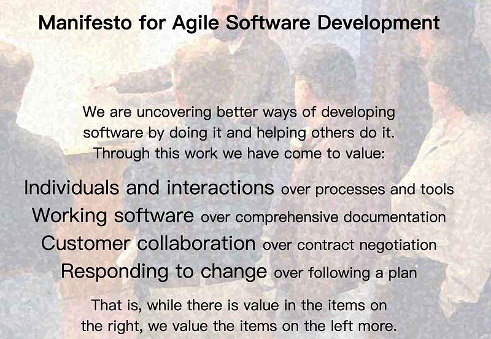
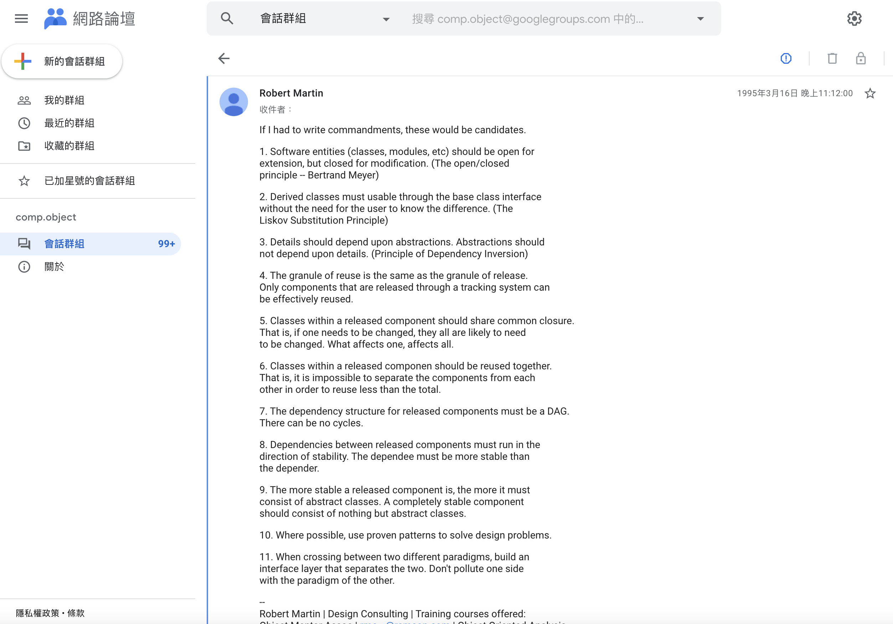
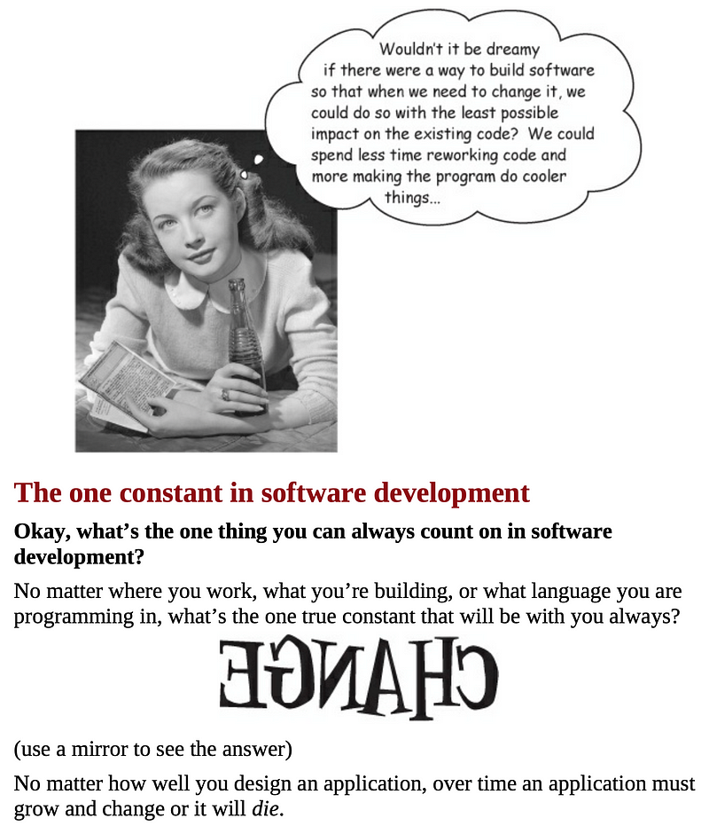

# 淺談「設計原則」的「閱讀姿勢」

---

> [!Tip]
> 有人說，「設計原則」就像是一種「經驗法則」，是前方大佬給我們的「告誡」；他們藉由這些「原則」告訴我們，應該如何才能撰寫出具有「高可維護性」的程式碼。
> 但就筆者的觀察，對於有些開發者而言，尤其是資歷較淺的開發者；「設計原則」就只是個「口號」，或是「告誡」。
> 有些「告誡」，它淺顯易懂，但「知道」跟「實踐」之間，完全是「鬆耦合」。
> 有些「告誡」，它貌似清晰，但卻不易理解，或存在「模糊邊界」，讓「經驗較為不足」的開發者容易陷入困惑。
> 有些「告誡」，它可能目標一致，但作法卻牴觸，「WTF」？
> 那怎樣才是閱讀「設計原則」最適合的「姿勢」呢？

---

## 前言

在開始進入文章之前，筆者想要先跟各位讀者建立一些共識；本文中所談論的所有設計原則及觀念，都是基於「物件導向」的「程式設計」，此外，雖然「物件導向」的程式語言，其概念都大同小異，但終究是存在差異，而筆者熟悉的語言是「Java」，因此，若有提到與程式碼相關的部分，基本上都會是以「Java」為例。

### 敏捷聯盟

在「軟體開發工程」的領域中，存在著各種不同的「流派」，百舸爭流；而不同的流派對於程式設計的「理念」、「見解」，以及「方法論」，也都各自不相同；以近幾年來說，最熱門的，不外乎就是以「Robert Martin」、「Martin Fowler 」、「Mike Beedle」、「Jim Highsmith」⋯等人為首的「敏捷聯盟」，關於「敏捷聯盟」的相關資訊，可以參考「[Manifesto for Agile Software Development](https://agilemanifesto.org/iso/en/manifesto.html)」。

事實上，「敏捷聯盟」並不是一個多有約束性的組織，他們就是一群對「軟體開發工程」有「理想」的人，而他們的「宣言」如下：

雖說「敏捷聯盟」並不是一個具有約束力的組織，但其成員多是在軟體界鼎鼎有名的大師，而由他們所提出的許多關於「軟體開發」的準則、理念，其都對之後的「軟體開發領域」有著相當深遠的影響，譬如最廣為人知的「SOLID」原則，其就是由「Robert Martin」所提出；「Robert Martin」，是知名的「軟體工程師」、「講師」和「作家」，也是「敏捷軟體開發」的主要推廣人之一，而他在社群網路上經常使用的暱稱是「Uncle Bob」，其經典著作如「[Agile Software Development, Principles, Patterns, and Practices](https://www.amazon.com/Software-Development-Principles-Patterns-Practices/dp/0135974445)」、「[Clean Code: A Handbook of Agile Software Craftsmanship](https://www.amazon.com/-/zh_TW/Clean-Code-Handbook-Software-Craftsmanship/dp/0132350882)」、「[Clean Architecture: A Craftsman's Guide to Software Structure and Design](https://www.amazon.com/-/zh_TW/Robert-Martin/dp/0134494164)」、「[Clean Agile: Back to Basics](https://www.amazon.com/Clean-Agile-Basics-Robert-Martin/dp/0135781868)」⋯等。

而「SOLID」原則，它又被稱為「物件導向程式設計」的「五大原則」，因為它的每一個「英文字母」都代表著一個「設計原則」，「SOLID」，其分別是「S, SRP, Single Responsibility Principle」、「O, OCP, Open-Closed Principle」、「L, LSP, Liskov Substitution Principle」、「I, ISP, Interface Segregation Principle」以及「D, DIP, Dependency Inversion Principle」，所以，它是一個「設計原則」，也是五個「設計原則」。

題外話，雖然「SOLID」，「五大原則」的概念是由「Robert Martin」所提出，但這並不是說其中的五個原則都是由他所提出。

當然，除了「Robert Martin」之外，「敏捷聯盟」的其它成員也都有提出或提倡一些知名的理論，例如「Kent Beck」，他是「極限編程」的創始人之一，而他所提出的理論是「簡單四原則」，詳見「[Xp Simplicity Rules](https://wiki.c2.com/?XpSimplicityRules)」；此外，還有就是「Martin Fowler」，由他所提倡的「三次重構法則」也是相當知名的「設計原則」，詳細資訊可以參考其著作：「[Refactoring: Improving the Design of Existing Code](https://www.amazon.com/Refactoring-Improving-Existing-Addison-Wesley-Signature-ebook/dp/B07LCM8RG2)」。

有人說，「設計原則」多半是一種「經驗法則」，是前方大佬給後輩的一些「告誡」；他們藉由傳遞這些「原則」來告訴我們：應該怎麼做才能撰寫出具有「高品質」的程式碼。

但不知道各位讀者有沒有想過，「設計原則」林林總總，萬壑爭流，別說其之間可能存在重覆或部分重疊的情況，甚至有些還是相互衝突、抵觸的；對此，我們應該如何來看待這些所謂的「設計原則」呢？

## 正文

### 什麼是「設計原則」？

延續前言中的問題：我們該如何來看待這些「設計原則」？

在回答這個問題之前，我們先來談談，「設計原則」是什麼，而「設計原則」的本質又是什麼？

在筆者看來，「設計原則」的本質其實就是一種「告誡」。

舉例來說，「Robert Martin」曾在他的個人部落格中發表過一篇文章，其篇名為「The Principles of OOD」，內容是在講述關於「OOD」的一些原則，文中，「Robert Martin」表示，他所介紹的這些關於「OOD」的原則，主要關注點都在於程式碼之間，「依賴關係」的管理，其原文如下：「The principles, however, focus very tightly on dependency management.」；接著他又說，若程式碼之間的「依賴關係」缺乏良好的管理，那麼就會導致程式碼變得脆弱、難以維護及重用，其原文描述如下：「Poor dependency managment leads to code that is hard to change, fragile, and non-reusable.」。

我們簡單總結一下，根據「[The Principles of OOD](http://www.butunclebob.com/ArticleS.UncleBob.PrinciplesOfOod)」的內容描述，我們可以知道「Robert Martin」想要傳遞給我們訊息是，他認為，倘若我們要開發出具有品質、且易於維護的「程式碼」，那我們應該遵循他提出的「開發原則」，注意程式碼之間的「依賴關係」，避免過度「耦合」的情況發生。

而這段話，是不是就像是一種「告誡」，一種「Robert Martin」想要傳遞給其它的軟體開發者、基於他個人過去經驗的「告誡」。

事實上，根據「Robert Martin」的說法，這些有關於「OOD」的原則，包含眾所周知的「SOLID」原則，都是源自於他在「1995」年於「Google groups comp.object」上的一個名為「The Ten Commandments of OO Programming」的討論串中的回覆，如下：

有注意到討論串的名稱嗎？

如圖所示，是「Commandments」，也就是「誡」；實際上，這個討論串就是在討論一些關於「OOD」在撰寫時應遵守的「誡」。

題外話，雖然前面說，在「The Ten Commandments of OO Programming」中的「回覆」，是其之後許多論點的原型；但事實上，這並不是他第一次發表有關於程式碼之間「相互依賴關係」的文章，在這篇討論串之前，「1994」年，「Robert Martin」就曾發表過一篇題目為「[OO Design Quality Metrics](https://www.semanticscholar.org/paper/OO-Design-Quality-Metrics-Martin-October/18acd7eb21b918c8a5f619157f7e4f6d451d18f8)」的論文；在該篇論文中，「Robert Martin」就曾說過，若程式碼之間缺乏良好的「相互依賴關係」，會導致程式碼產生「僵化（Rigidity）」、「脆弱（Fragility）」⋯等現象。

倘若各位讀者曾經閱讀過他的著作，應該就會發現，「Robert Martin」對於「相互依賴關係」非常的重視，這點在他一直以來的論述都是，差別只在於「Robert Martin」在早期時，其觀點比較著重於「程式碼」本身，而到中期之後，就更多著眼在「系統架構」的層級；而「Robert Martin」最核心的「SOLID」原則亦在這個過程中不斷地昇華，關於「Robert Martin」的一些論點，未來若有機會，筆者會再另闢戰場，在此，我們暫時不過多著墨。

接著我們繼續談，剛才說「設計原則」的本質是「告誡」，那麼「設計原則」是什麼？

筆者的答案是，「設計原則」是「軟體開發人員」在進行程式設計時，其應該遵循的「準則」，其可能是一種「概念」、一種「思維」，甚至是一些「經驗」的總結。

一般來說，「設計原則」通常比較抽象，不是一套可以直接套用「SOP」；因此，曾有人以「武功」來比喻之，說「設計原則」就像是「內功心法」，吃透並能活用「設計原則」的人就像「天龍八部」中，金庸筆下的「虛竹」，僅擁有高深的「內力」。

但「武功」並不是只有「內力」，還有招式，而「設計模式」就是招式，兩者相輔相成；僅了解「設計原則」而不明「設計模式」的人，常會面臨徒有想法，卻不得其門，乃至淪為空談，反之，僅有「設計模式」，卻不懂「設計原則」的人，因僅具其形，不得其意，知其然不知其所以然，就容易在程式設計時華而不實，落入過度設計的陷阱裡。

### 面對「設計原則」的態度

在介紹完什麼是「設計原則」之後，接著，我們就要來談談，應該用怎樣的態度來看待「設計原則」。

在上一小節中，我們說，「設計原則」是前人給予我們的「告誡」，雖然筆者無法保證這些前人給的「告誡」都是正確的，但凡能通過時間考驗，那些耳熟能詳的「設計原則」，必然有其一定的道理，所以，在大多數的情況，筆者認為，我們應該盡量地遵循並體悟之；筆者相信，這能幫助我們建立良好的開發觀念，讓我們在軟體開發的道路上少走不少彎路。

話雖如此，但「設計原則」如此之多，而當我們在面對它時，難免會碰到一些現實層面的限制，譬如「時間成本」的提高；在軟體開發的過程中，我們的程式碼難免會遇到需要「重構」，譬如架構調整、共用抽取、抽象⋯等；另外，若開發者對於「業務邏輯」或「程式架構」不夠熟悉的話，也會使得開發時所需的「時間成本」提高。

除了有可能會受限於「現實層面」的情況之外，還有就是有些「設計原則」的論述相對不直白，或其存在模糊的邊界，讓一些經驗較不足的開發者不易理解，從而造成誤會或困惑，舉例來說，如「Robert Martin」在早期時，其對「單一職責原則（SRP）」的描述，如下：「A class should have only one reason to change.」。

該段描述是源自於「[Agile Software Development, Principles, Patterns, and Practices](https://www.amazon.com/Software-Development-Principles-Patterns-Practices/dp/0135974445)」一書，而這個「論述」，引起了眾多軟體開發者的抨擊，說其描述過於籠統、模糊，不夠明確；其中比較知名的如「Dan North」，他是「CUPID」原則的提出者，詳細內容可以參考其部落格文章：「[CUPID—for joyful coding](https://dannorth.net/2022/02/10/cupid-for-joyful-coding/)」；此外，「Dan North」還是個「SOLID」原則的反對者，而在他所發表的言論中，不乏他對「SOLID」的「諷刺」，譬如「[CUPID—the back story](https://dannorth.net/cupid-the-back-story/)」。

題外話，面對「Dan North」的質疑，「Robert Martin」也曾在他個人的落格中公開回應，「Robert Martin」在回應裡更進一步的去解釋「SOLID」原則中的每個原則的意義，完整內容請見「[Solid Relevance](http://blog.cleancoder.com/uncle-bob/2020/10/18/Solid-Relevance.html)」。

說實話，比起「Dan North」說法，筆者還是比較推崇「Robert Martin」的觀點，但這並不代表「Dan North」是在胡說八道，實際上，也正是因為有「Dan North」的質疑，我們才能更清楚了解「Robert Martin」想傳遞的「SOLID」原則。

其實，筆者認為，「戰」不見得都是個壞事，在我們的生活中，難免會碰到觀點不同的異己者，此時，只要保持「理性」、「尊重」，我們不妨與之一辯，正所謂：「真理越辯越明」。

接著，再舉一個例子，「聚合覆用原則（CARP）」，其意思是說，在程式設計時，以「組合」或「聚合」的方式來替代「繼承」；這是因為「繼承」關係會讓程式碼間的耦合度較高，其原文描述為：「Composition / aggregate reuse principle.」；該原則的論述其實相當明確，而它的問題在於「缺乏明確的界線」，對於一些經驗較為不足的開發者來說，他們可能有難以準確判斷使用時機的問題，甚至以為不應該使用「繼承」；但事實上並不是的，「CARP」原則通常會與「里氏替換原則（LSP）」一起被提起，其描述應該是：盡量使用「組合」或「聚合」來替代「繼承」，但若非不得已需要使用「繼承」，則應遵循「里氏替換原則」。

事實上，「CARP」與「LSP」兩者都是「開閉法則（OCP）」的實踐手段。

注意到了嗎？其實許多「設計原則」之間都存在著一些關係，又譬如「單一職責原則（SRP）」與「關注點分離原則（Separation of Concerns, SoC）」；其者兩者在某個層面上是「相似的」，只是，相較於「SRP」，「SoC」更為抽象一些，關於「SRP」的介紹，未來有機會的話，筆者會特地寫一篇文章來介紹。

但並不是所有「設計原則」的論點都如「CARP」與「LSP」是相輔相成，又或如「SRP」與「SoC」是部分重疊，在百家爭鳴的「理論」中，其之間也必然存在相互衝突、抵觸的論述。

譬如「DRY」原則與「WET」原則，「DRY」，其全文為「Don't repeat yourself.」，意即「不要重覆程式碼」，而「WET」，全文為「Write everything twice.」，簡單說就是，將同樣的程式碼寫兩次，當然，或許有人聽過類似「We enjoy typing.」，亦或是「Waste everyone's time」⋯等「諷刺意味」較為強烈的「解讀」，但不管怎樣，總地來說，「DRY」與「WET」幾乎可以說是完全「背道而馳」的兩個原則。

其中，「DRY」原則是一個多數軟體開發者都耳熟能詳的「設計原則」，事實上，在筆者的軟體開發經驗中，「避免重覆程式碼」的這個觀念可以說是根生蒂固，「重覆程式碼（Duplicate code）」不僅本身就是程式設計中，惡名昭彰的「壞味道（Bad Smell）」之一，其還可能會導致另一個的「壞味道」：「霰彈式修改（Shotgun surgery）」。

但仔細思考一下，「WET」就真的沒道理嗎？

美國一位知名的軟體工程師「Sandi Metz」就曾說過：「Duplication is cheaper than the wrong abstraction.」；就如同字面上的意思，「Sandi Metz」認為「重覆程式碼」所產生的「技術債」比起「錯誤的抽象（Wrong abstraction）」所造成的「技術債」還要「低廉」，更多內容請參考「Sandi Metz」的部落格文章：「[The Wrong Abstraction](https://sandimetz.com/blog/2016/1/20/the-wrong-abstraction)」。

然而，基於該論點，另一位軟體工程師「Kent Dodds」就提出了「AHA Programming」的概念，事實上，該理論最早被命名為「MOIST」，但經過幾次轉輒後，方以「Cher Scarlett」提出的「AHA」為之命名，其意思為「Avoid hasty abstractions.」，即「避免過早抽象」，詳見「[AHA Programming](https://kentcdodds.com/blog/aha-programming)」一文。

除了「WET」之外，「DRY」也與「三次重構原則（Rule of three）」存在部分的「牴觸」；「三次重構原則」是「Martin Fowler」所提倡的「設計原則」，它是由「Don Roberts」所提出的，其原文的描述為：「Three strikes and you refactor.」；其意思很直白，就是說，倘若一段程式碼重覆了三次以上，那就應該將之重構，不過「兩次」呢？

有另外一個設計原則名為「KISS」，其全文為：「Keep it simple stupid.」，意思很直白，就是保持代碼簡單、易懂，其文中的「Stupid」與「傻瓜相機」的「傻瓜」、「防呆裝置」的「呆」，其意義類似，並非貶義詞，而是指說，在閱讀、使用上非常地「容易」。

若遵循「DRY」原則，那當我們程式碼存在共用邏輯，我們就應該將其抽取，但倘若該段程式碼就僅有兩個地方會使用到呢？我們真的有必要將其特地抽出嗎？

是否保留「重覆程式碼」的方式會更貼近「KISS」中所闡述的「Simple & stupid」呢？

我們思考一下，「重覆程式碼」真的那麼萬惡嗎？

並不盡然，就如同「[Five Lines of Code: How and when to refactor](https://www.amazon.com/Five-Lines-Code-When-Refactor/dp/B09NCHWVG1)」一書的作者「Christian Clausen」所描述，他認為，「重覆程式碼」能增加「區域性」之行為改變的速度，原文如下：「Sharing code increases global behavior-change velocity, while duplicating code increases local behavior-change velocity.」；事實上，近幾年由於「微服務」的盛行，「DRY」似乎已經不再是鐵則；「微服務」是一種「分散式」的「軟體架構」，其與傳統的「單體式應用」不同，在「微服務」的概念中，它認為一個「完整」的「應用程式」，應該是由多個「小型服務」所構成，且每個「小型服務」都應該是一個可「獨立運行」的單位，此外，「小型服務」間應為完全的「鬆耦合」，甚至是擁有各自獨立的資料庫。

在如此的概念下，「共用程式碼」的代價就變得更加昂貴，如同「[The Dilemma of Code Reuse in Microservices](https://blog.bitsrc.io/the-dilemma-of-code-reuse-in-microservices-a925ff2b9981)」一文中的描述，其作者認為，在「微服務」的架構中，不當的「共用程式碼」可能造成其架構的獨立性被破壞。

其實閱讀到這裡，讀者們應該都發現了，不論「DRY」、「WET」、「KISS」還是「Rule of Three」，它們都有其存在的道理，之所以會存在「抵觸」，其可能是因為「環境差異」所導致，像是「單體式應用」與「微服務架構」的不同，也可能「角度不同」，譬如「DRY」認為應該避免程式碼「重覆」，而「WET」認為，不應該「過早優化」，不過，若仔細思考就會發現，其實它們的目標都是一致的，就是提高「程式碼」的「可維護性」。

所以，我們該如何看待「設計原則」呢？

說到底，仍然是必須取決於我們的「目的」與「環境」，例如，專案的規模、性質，而不是一昧地將某些「設計原則」奉為圭臬，無限上綱；「程式設計」從來就不是「唯一解」，就如同「林信良」在「[設計原則五四三](https://www.ithome.com.tw/voice/97462)」中所描述的，死抱著「SOLID」原則，試圖完美遵守的感受，問題就在於：程式碼不存在所謂的完美設計。

在「[Clean Code: A Handbook of Agile Software Craftsmanship](https://www.amazon.com/-/zh_TW/Clean-Code-Handbook-Software-Craftsmanship/dp/0132350882)」一書中，它的作者「Robert Martin」曾在該書中說，他認為，比起「技術」教科書，他認為該書的意義更像是一門「藝術」教科書，一門關於軟體開發的「藝術」；而筆者認為，「設計原則」亦是如此。

那什麼是「藝術」？

筆者曾聽過有人是這麼形容的，他說，藝術就是一種追求的完美的過程，它將不斷迭代，它亦不存在終點。

程式設計不也就如此嗎？

不同的專案之間，其程式設計的「標準」應該也要有所不同；既便是在同一個專案裡，其「Context」、「Boundary」也會隨著專案進度的發展、需求的新增而產生變化，因此，當專案因為新的需求而異動時，我們就必須重新審思，該專案當前的設計與架構是否符合我們的需求，若已不符合需求，我們必須對其「修正」，甚至是「重構」，而不是為了功能開發而不管既有結構的「疊床架屋」。

在「[Head First Design Patterns: A Brain-Friendly Guide](https://www.amazon.com/Head-First-Design-Patterns-Brain-Friendly/dp/0596007124)」一書中，其有一段描述相當地經典，它的內容是說，在「軟體開發」的領域中，其唯一不變的「真理」就是「改變」，如下：

### 程式碼風格

最後，我們來談談「程式碼風格（Coding Style）」；事實上，我們可以將「程式碼風格（Coding Style）」當作一種「設計原則」；「程式碼風格」是一種對於「撰寫程式碼」的規範。

事實上，就如先前所說，在「程式設計」的領域中，其並不存在所謂的「完美程式碼」，絕對大多數的「設計原則」、「程式碼規範」都是為了讓撰寫出來的程式碼更易懂、更容易被維護。

其實大多數的專案都無法避免與他人合作，不論是共同開發，還是接手維護，所以我們應該要遵守一個共同的規範，讓合作者能更容易的開發、維護；其實大多數企業團隊都會制定自己的「程式碼撰寫規範」，即便沒有，在網路上也能找到有不少知名企業提供的他們的「程式碼撰寫守則」，譬如「Oracle」的「[Code Conventions for the Java™ Programming Language](https://www.oracle.com/java/technologies/javase/codeconventions-contents.html)」、「Google」的「[Google Java Style Guide](https://google.github.io/styleguide/javaguide.html)」、「Alibaba」的「[Alibaba-Java-Coding-Guidelines](https://github.com/alibaba/Alibaba-Java-Coding-Guidelines)」及「[Alibaba Java Coding Guidelines pmd implements and IDE plugin](https://github.com/alibaba/p3c)」；其實，若各位讀者去翻閱就會發現，這些「程式碼撰寫守則」的內容都大同小異，事實上，與其說它們是一種規則，筆者更覺得，其更像是一種開發者共識。

不過，有些企業團隊的「程式碼撰寫守則」會制定的比較詳細，甚至可能與上述的「開發者共識」有些衝突，這是因為那些團隊在制定規則時，其可能考量到團隊多數成員的「習慣」、「共識」，亦或是「專案的特性」，此時，我們就應該以「團隊規範」為最高準則。

## 參考資料

- [Robert Martin, Agile Software Development, Principles, Patterns, and Practices](https://www.amazon.com/Software-Development-Principles-Patterns-Practices/dp/0135974445)
- [Robert Martin, Clean Code: A Handbook of Agile Software Craftsmanship](https://www.amazon.com/-/zh_TW/Clean-Code-Handbook-Software-Craftsmanship/dp/0132350882)
- [Robert Martin, Clean Architecture: A Craftsman's Guide to Software Structure and Design](https://www.amazon.com/-/zh_TW/Robert-Martin/dp/0134494164)
- [Robert Martin, Clean Agile: Back to Basics](https://www.amazon.com/Clean-Agile-Basics-Robert-Martin/dp/0135781868)
- [Robert Martin, The Principles of OOD](http://www.butunclebob.com/ArticleS.UncleBob.PrinciplesOfOod)
- [Robert Martin, OO Design Quality Metrics](https://www.semanticscholar.org/paper/OO-Design-Quality-Metrics-Martin-October/18acd7eb21b918c8a5f619157f7e4f6d451d18f8)
- [Robert Martin, Solid Relevance](http://blog.cleancoder.com/uncle-bob/2020/10/18/Solid-Relevance.html)
- [Kent Beck, Xp Simplicity Rules](https://wiki.c2.com/?XpSimplicityRules)
- [Martin Fowler, Refactoring: Improving the Design of Existing Code](https://www.amazon.com/Refactoring-Improving-Existing-Addison-Wesley-Signature-ebook/dp/B07LCM8RG2)
- [Google groups comp.object, The Ten Commandments of OO Programming](https://groups.google.com/g/comp.object/c/WICPDcXAMG8/m/EbGa2Vt-7q0J)
- [Dan North, CUPID—for joyful coding](https://dannorth.net/2022/02/10/cupid-for-joyful-coding/)
- [Dan North, CUPID—the back story](https://dannorth.net/2021/03/16/cupid-the-back-story/)
- [Sandi Metz, The Wrong Abstraction](https://sandimetz.com/blog/2016/1/20/the-wrong-abstraction)
- [Kent Dodds, AHA Programming](https://kentcdodds.com/blog/aha-programming)
- [Christian Clausen, Five Lines of Code: How and when to refactor](https://www.amazon.com/Five-Lines-Code-When-Refactor/dp/B09NCHWVG1)
- [Ashan Fernando, The Dilemma of Code Reuse in Microservices](https://blog.bitsrc.io/the-dilemma-of-code-reuse-in-microservices-a925ff2b9981)
- [Eric Freeman, Head First Design Patterns: A Brain-Friendly Guide](https://www.amazon.com/Head-First-Design-Patterns-Brain-Friendly/dp/0596007124)
- [林信良, 設計原則五四三](https://www.ithome.com.tw/voice/97462)
- [Oracle, Code Conventions for the Java™ Programming Language](https://www.oracle.com/java/technologies/javase/codeconventions-contents.html)
- [Google, Google Java Style Guide](https://google.github.io/styleguide/javaguide.html)
- [Alibaba, Alibaba-Java-Coding-Guidelines](https://github.com/alibaba/Alibaba-Java-Coding-Guidelines)
- [Alibaba, Alibaba Java Coding Guidelines pmd implements and IDE plugin](https://github.com/alibaba/p3c)
